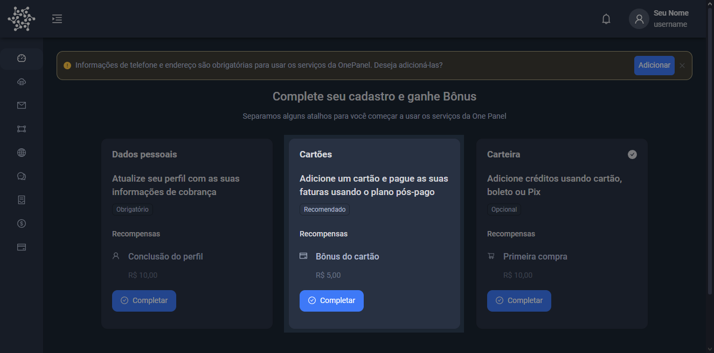
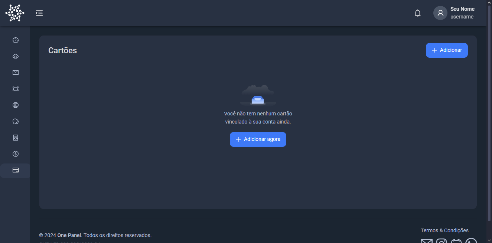
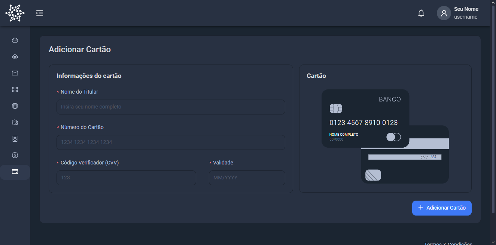
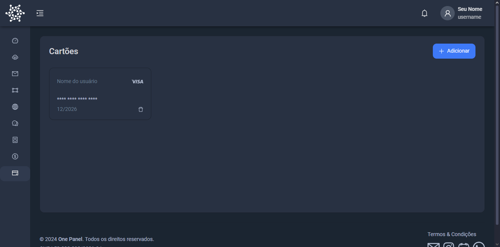

### Adicionando um cartão

O uso de um cartão para pagamentos pós-pago  permite que você utilize os serviços e faça compras agora, pagando posteriormente
 
Para adicionar um cartão você pode ir até a tela inicial e escolher a opção disponivel, ou acessar diretamente pela barra lateral, vamos adicionar um cartão; clique em **Adicionar Cartão**

Você se deparará com esta tela. Clique no botão **Adicionar Agora**

Pronto, agora vamos adicionar um cartão!
---

Preencha os dados do formulário:
* Nome do Titular
* Número do Cartão
* Código Verificador (CVV)
* Validade

:::tip DICA

Você pode ver uma prévia em tempo real no painel direito.

:::

Com todos os dados já preenchidos clique no botão **Adicionar Cartão** para confirmar a adição

:::success Muito bem!

Agora que você tem suas seu cartão de crédito adicionado.

:::

