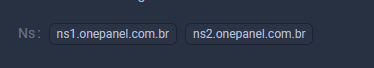

---  
title: Adicionar um domínio  
sidebar_position: 4.2  
---

# Como adicionar um domínio

Adicionar um domínio ao seu painel OP é um processo simples, que pode ser feito em algumas etapas. Vamos orientá-lo com um exemplo real, além de fornecer orientações sobre como configurar os servidores de DNS no painel do seu provedor.

## Passo a Passo para Adicionar um Domínio

### 1. Vá até a Área de Domínios

Navegue até a área de gerenciamento de domínios dentro do seu painel OP.

### 2. Clique em `Adicionar`

Após acessar a área de domínios, clique no botão `Adicionar` para iniciar o processo.

### 3. Insira o Nome do Domínio

No campo de **Nome do Domínio**, insira o nome do domínio que você deseja adicionar ao painel. Certifique-se de usar um domínio que você já possui, como por exemplo: `seudominio.com.br`.

> **Nota:** Não insira `onepanel.com.br`, este é apenas um exemplo. Use o domínio que você registrou e pretende configurar.

### 4. Ações

Após adicionar o domínio, clique em `Ações` para acessar mais opções de configuração.

## Configuração dos DNS (Nameservers)

Agora você precisará configurar os **Nameservers (NS)** do seu domínio para que ele funcione corretamente no painel OP. Isso deve ser feito diretamente no provedor onde o domínio foi registrado, como Cloudflare, GoDaddy, Registro.br, entre outros.

### Exemplo de Configuração no Cloudflare:

1. Acesse o painel de controle do Cloudflare.
2. Clique no domínio que você deseja configurar.
3. Vá até a aba **DNS** e localize a seção de **Nameservers**.
4. Altere os **NS** para apontar para os servidores indicados no painel OP.

> Para instruções detalhadas, veja a [documentação oficial do Cloudflare](https://support.cloudflare.com/hc/pt-br/articles/205195708-Como-alterar-seus-servidores-DNS-e-apontar-seu-dom%C3%ADnio-para-o-Cloudflare).

### Exemplo de Configuração no GoDaddy:

1. Acesse sua conta no GoDaddy.
2. No menu, vá até **Meus Produtos** e localize o domínio que deseja configurar.
3. Clique em **Gerenciar DNS**.
4. Role até a seção **Nameservers** e clique em **Alterar**.
5. Substitua os Nameservers pelos fornecidos no painel OP.

> Veja o guia da GoDaddy [aqui](https://br.godaddy.com/help/alterar-os-servidores-de-nomes-664).

### Exemplo de Configuração no Registro.br:

1. Acesse sua conta no Registro.br.
2. Selecione o domínio que deseja configurar.
3. Vá até a aba **DNS** e insira os Nameservers fornecidos pelo painel OP.

> Veja o tutorial do Registro.br [aqui](https://registro.br/ajuda/gerenciamento-de-conta/alterar-servidores-dns/).

### Verifique as Configurações

Após alterar os **Nameservers** no seu provedor de domínio, pode levar algumas horas para que as alterações se propaguem globalmente. Depois disso, seu domínio estará totalmente configurado e funcional no painel OP.

---

Essa versão inclui exemplos práticos e links para a documentação de provedores populares, permitindo que o usuário saiba exatamente como realizar as etapas de configuração. Isso oferece uma experiência mais completa e integrada.
