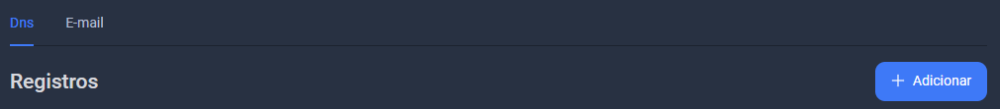
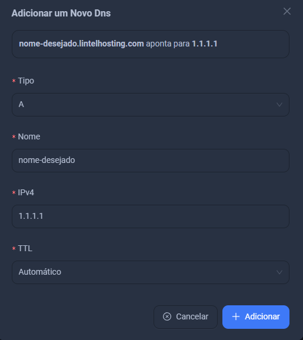
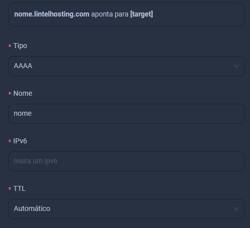
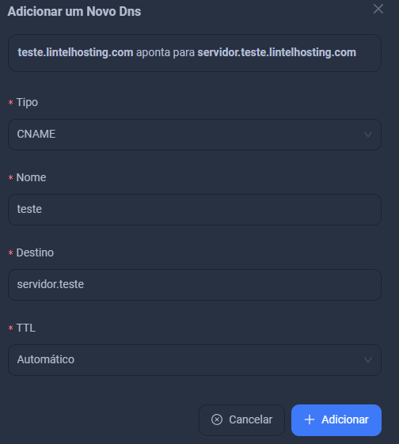

---  
title: Como configurar o DNS 
sidebar_position: 4.1  
---

import Tabs from '@theme/Tabs';  
import TabItem from '@theme/TabItem';

## Como Adicionar Registros DNS

Para adicionar serviços de DNS, clique em `Adicionar`.

<Tabs>  
  <TabItem value="dns1" label="DNS Tipo A" default>

### 1. Criando um Registro Tipo A

O registro **A** é usado para apontar um domínio para um endereço **IPv4**.

1. No campo `Tipo de DNS`, selecione **A**.
2. Preencha os campos solicitados, como mostrado na imagem abaixo:
   
   - **Nome**: O subdomínio que deseja usar, como `www`.
   - **Endereço IPv4**: O endereço IP para o qual o domínio deve apontar.
   
   Exemplo: Para `www.seudominio.com.br`, você usaria `www` como nome e o IPv4 do servidor.

3. Clique em `Adicionar`. Agora seu registro **A** está configurado.

</TabItem>

<TabItem value="dns-aaa" label="DNS Tipo AAA">

### 2. Criando um Registro Tipo AAAA

O registro **AAAA** funciona de forma semelhante ao registro **A**, mas é utilizado para apontar um domínio para um endereço **IPv6**, que é a versão mais recente dos endereços IP.

1. No campo `Tipo de DNS`, selecione **AAAA**.
2. Preencha os campos solicitados com o nome e o endereço IPv6.

   - **Nome**: O subdomínio que deseja usar, como `www`.
   - **Endereço IPv6**: O endereço IPv6 para o qual o domínio deve apontar.

3. Clique em `Adicionar` para configurar seu registro **AAAA**.

</TabItem>

<TabItem value="cname" label="CNAME">

### 3. Criando um Registro CNAME

O registro **CNAME** é usado para criar um **alias** para outro domínio. Isso é útil para redirecionar um subdomínio para um domínio existente sem precisar apontá-lo para um IP diretamente.

1. No campo `Tipo de DNS`, selecione **CNAME**.
2. Preencha os campos solicitados:

   - **Nome**: O subdomínio que deseja redirecionar, como `blog`.
   - **CNAME**: O domínio para o qual você quer redirecionar o subdomínio (por exemplo, `seudominio.com.br`).

3. Clique em `Adicionar` para configurar o registro **CNAME**.

</TabItem>  
</Tabs>

---

