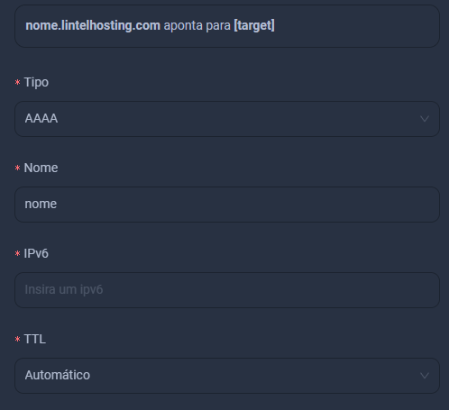

import Tabs from '@theme/Tabs';
import TabItem from '@theme/TabItem';

Para adicionar os serviços DNS clique em Adicionar

<Tabs>
  <TabItem value="dns1" label="DNS Tipo A" default>
    Vamos criar um dns tipo `A` para `IPv4`
    Você pode preencher os dados como explicado na imagem a baixo.

Então basta clicar em `Adicionar` e pronto, estará funcionando seu DNS.

Aqui, o nome ficará como `nome-desejado.lintelhosting.com` no seu caso, será seu domínio.

  </TabItem>
  <TabItem value="dns-aaa" label="DNS Tipo AAA">
      Vamos criar um dns tipo `AAA` para `IPv6`
      Primeiro você seleciona o Tipo de DNS, coloque o `AAA`

     
    Você pode preencher os dados como explicado na imagem a baixo.

Neste caso o nome ficará como `nome.lintelhosting.com` redirecionando para o IPv6.

Após isso basta clicar em criar também.
  </TabItem>
  <TabItem value="cname" label="CNAME">
  Para adicionar um DNS `CNAME` você deve mudar o registro de `A` que é o padrão para CNAME
  da seguinte forma: 

Agora é so completar com os dados do seu dominio para redirecionamento.

</TabItem>
  
</Tabs>