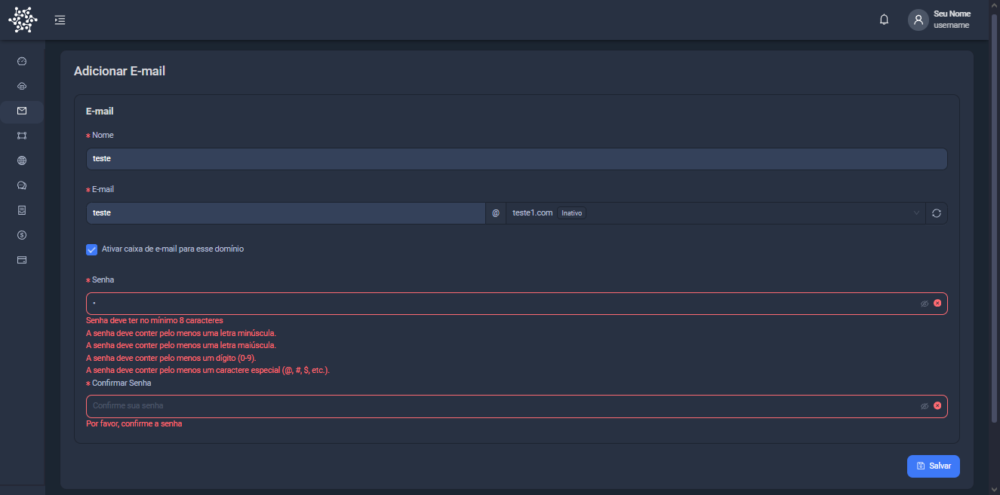

import Tabs from '@theme/Tabs';
import TabItem from '@theme/TabItem';

# Opções de Email

Na One Panel você tem 2 tipos de email professional, sendo eles `seuemail@onelpanel.com.br` e `seuemail@seudominio.com.br`

Como posso criar um email professional?

É Simples! Siga os passos a baixo!

<a href="https://console.onepanel.com.br/app/email">Clique aqui para criar um email personalizado</a>

Vá para a tela de `E-mail`, clique em `Adicionar` e preencha os campos com as seguintes informações:

- Nome Para o Email: `seu-nome`
- Email Personalizado: `joao`
- Seu Domínio Excolhido: `@teste.com.br`
- Senha: `sua senha`
- Confirmar senha: `sua senha novamente`

Nesse exemplo, o e-mail ficará como `joao@teste.com.br`

Após isso clique em `Adicionar` e pronto, seu email estará criado.
