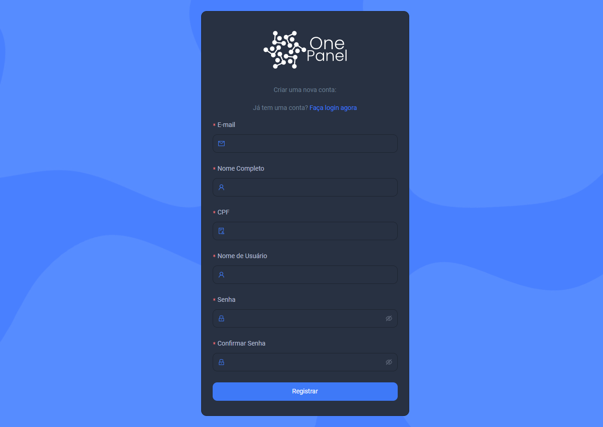
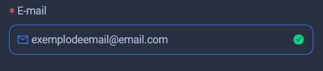
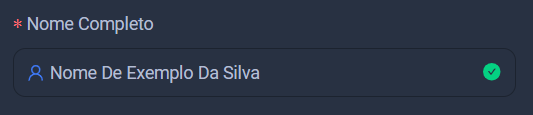
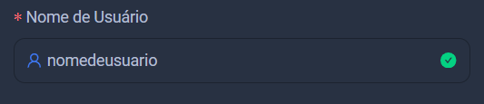

import Tabs from '@theme/Tabs';
import TabItem from '@theme/TabItem';

# Primeiros Passos

Neste guia, vamos explorar juntos as funcionalidades básicas da plataforma, para que você possa aproveitar ao máximo tudo o que temos a oferecer.

:::info

Essa documentação irá guiar você durante todo o processo de registro na plataforma.

:::

## Registro
Essa é a tela de registro da plataforma:

* [Ir para a tela de registro](https://console.onepanel.com.br/auth/register)

A tela de registro será seu primeiro contato com a plataforma, é necessário ter um registro para conseguir prosseguir dentro da platafoma

Vamos explicar cada um dos campos:

<Tabs>
  <TabItem value="email" label="E-mail" default>
    Nesse campo você precisa colocar seu e-mail válido

  </TabItem>
  <TabItem value="nome completo" label="Nome Completo">

Nesse campo você irá colocar o seu nome completo.

  </TabItem>
  <TabItem value="nome de usuário" label="Nome de Usuário">
Um nome de usuário é uma identificação única que você usa em uma plataforma, funcionando como um apelido. Ele é utilizado para distinguir sua conta de outras, mas não é necessariamente o nome pelo qual você é chamado na interação.

  </TabItem>
  <TabItem value="Senha" label="Senha">
  A senha é uma combinação de caracteres utilizada para proteger sua conta e garantir a segurança das suas informações. Uma senha forte é essencial para proteger seus dados pessoais e assegurar a integridade da sua conta.

:::tip

Este é um exemplo de senha forte

    

:::

    
  </TabItem>
</Tabs>

## Completar o seu cadastro

Para aproveitar ao máximo todas as funcionalidades oferecidas pela One Panel, é importante que você complete seu cadastro inserindo seus dados pessoais. Siga para a próxima aba.

