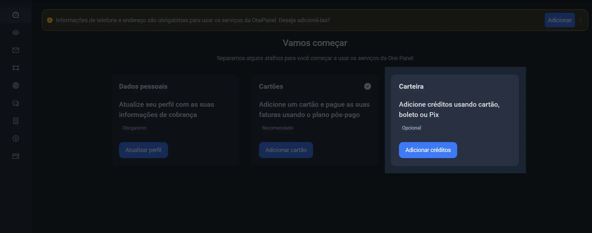
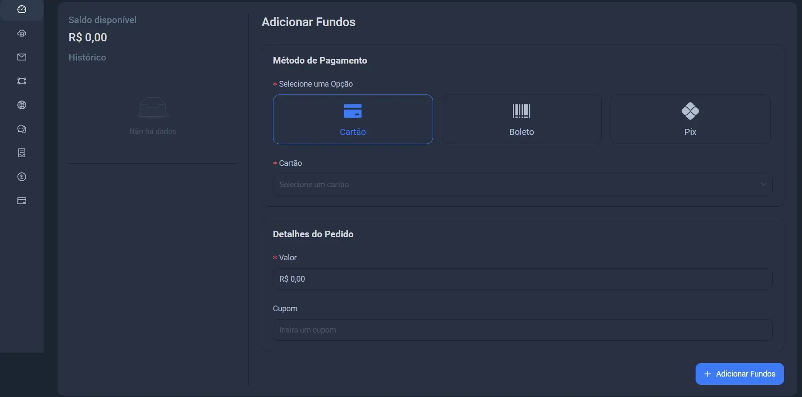

### fundos são necessário para pagamento pré pago

Os fundos referem-se ao saldo disponível na sua carteira digital. Eles podem ser utilizados para realizar compras na plataforma,
você pode adicionar fundos à sua carteira através de métodos como cartão, boleto ou pix.

### Vamos agora inserir fundos na sua carteira.

