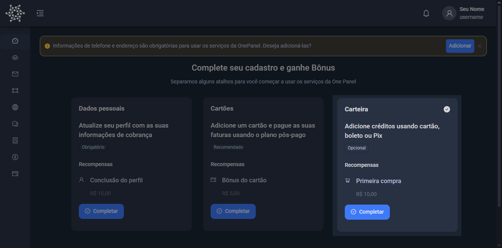
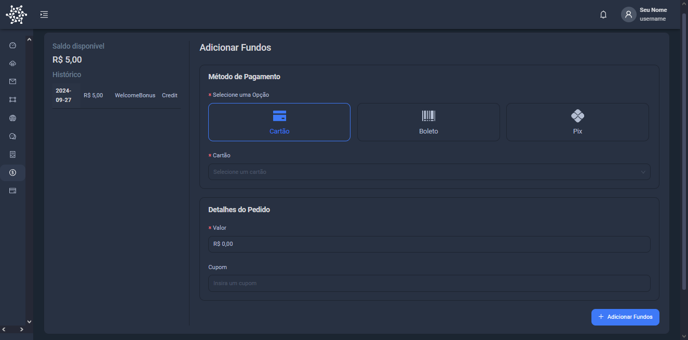

## Fundos são necessários para o pagamento pré-pago

Os fundos referem-se ao saldo disponível na sua carteira digital. Eles podem ser utilizados para realizar compras na plataforma. Você pode adicionar fundos à sua carteira através de métodos como cartão de crédito, boleto bancário ou Pix.

Para adicionar fundos à sua carteira, siga as etapas abaixo:

1. Acesse a seção **Carteira** no console.
2. Escolha o método de pagamento: **Cartão de crédito**, **Boleto** ou **Pix**.
3. Insira os dados necessários para completar a transação.

Após concluir o processo, o saldo será atualizado na sua conta e você poderá utilizá-lo para adquirir serviços como VPS.
