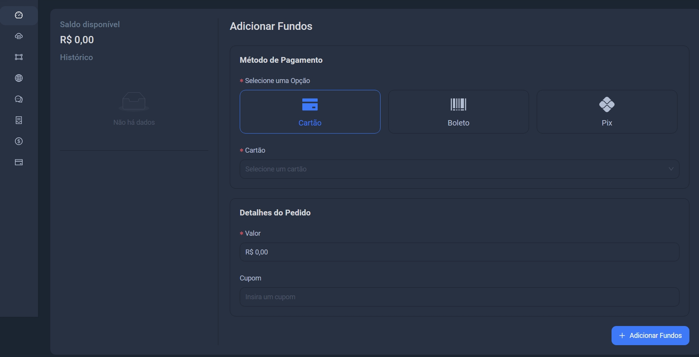
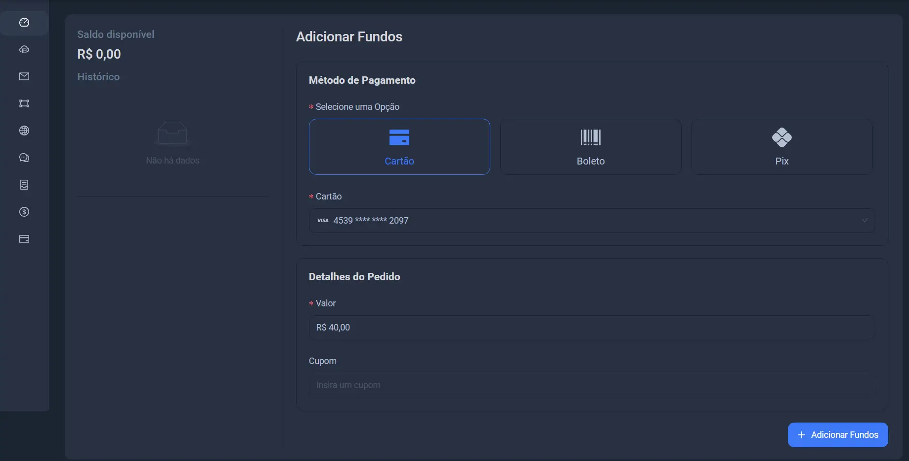
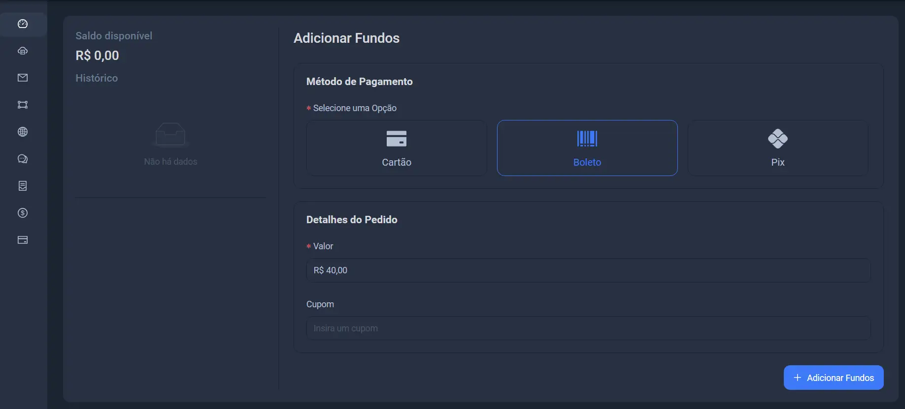
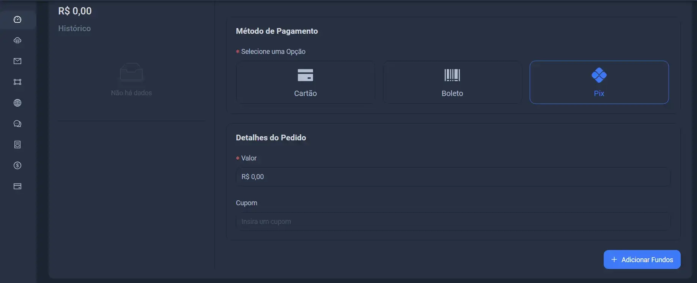

import Tabs from '@theme/Tabs';
import TabItem from '@theme/TabItem';

### fundos são necessário para pagamento pré pago

Os fundos referem-se ao saldo disponível na sua carteira digital. Eles podem ser utilizados para realizar compras na plataforma,
você pode adicionar fundos à sua carteira através de métodos como cartão, boleto ou pix.

### Vamos agora inserir fundos na sua carteira.

Ao adicionar fundos, você pode escolher entre três formas de pagamento: cartão, boleto ou Pix.

<Tabs>
  <TabItem value="Cartão" label="Cartão" default>
    
:::tip

Para adicionar fundos usando o cartão, você precisa ter um cartão cadastrado. Caso não tenha, clique neste link para cadastrá-lo.
[Adicionar Cartão](/inicio/cartoes/#adicionando-um-cartão)

:::

## Detalhes do Pedido

Agora que você já adicionou um cartão ou já possui um cadastrado, selecione a opção **Cartão**. Ao clicar nela, a opção com o seu cartão aparecerá logo abaixo. 
Clique nela para adicionar o cartão aos fundos e, em seguida, vá até a seção **Valor** e insira o valor da sua preferência.

  </TabItem>
  <TabItem value="Boleto" label="Boleto">
    

Você receberá um boleto com o valor e a data de vencimento. O pagamento pode ser efetuado em bancos, casas lotéricas, aplicativos bancários ou sites de pagamento. 
Após o pagamento, pode levar alguns dias para que o valor seja confirmado e refletido em sua conta.

  </TabItem>
  <TabItem value="Pix" label="Pix">

Escolha o valor desejado e insira-o no site. Ele exibirá um QR Code ou uma chave Pix.
 Abra o app do seu banco, escaneie o QR Code ou digite a chave, verifique os detalhes e confirme o pagamento. O valor será transferido instantaneamente.
  </TabItem>
</Tabs>

:::info CUPONS

Com cupons, você pode obter descontos, combinar cupons e pagar menos por produtos ou serviços.
 Os cupons são geralmente distribuídos em eventos promocionais, por parceiros selecionados, em datas comemorativas, entre outros canais.

:::
