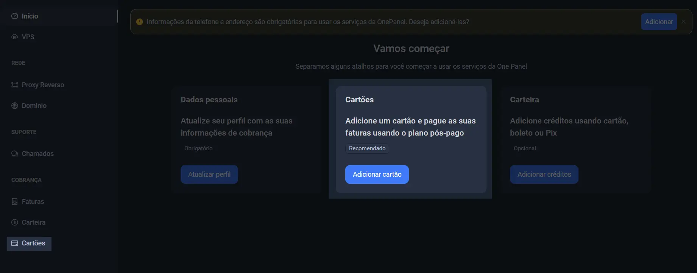
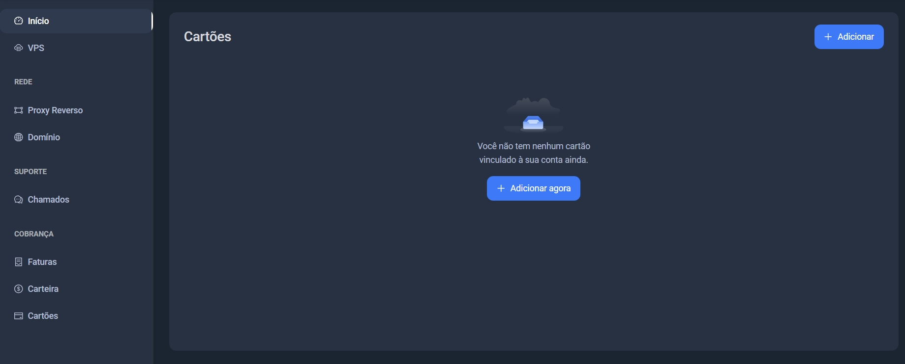

### cartao de credito é necessario para pagamento pós pago

### Adicione um cartão

O uso de um cartão para pagamentos pós-pago  permite que você utilize os serviços e faça compras agora, pagando posteriormente
 Para adicionar um cartão você pode ir até a tela inicial e escolher a opção disponivel, ou acessar diretamente pela barra lateral, vamos adicionar um cartão; clique em 'Adicionar Cartão'

Quando você clicar em 'Adicionar Cartão', você se deparará com esta tela. Clique em 'Adicione Agora'.

