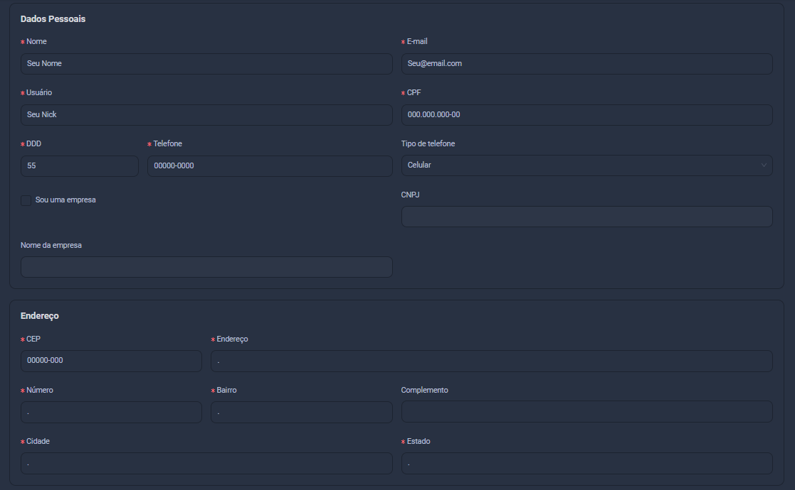

Uma vez com sua conta criada, você será redirecionado para a tela inicial da plataforma, também conhecida como "console". Aqui é onde toda a sua interação com a plataforma ocorrerá, mas para prosseguir, precisamos primeiro completar o seu cadastro. Esta página irá te guiar por esse processo.

## Atualizando seu perfil

Por padrão, a One Panel não exige que você coloque nenhum dado pessoal sensível na plataforma (fora sua senha). Portanto, você precisa fazer isso após entrar, caso queira utilizar o serviço.

Para começar, utilize um dos quadros para "Atualizar perfil".

Por favor, complete todos os campos obrigatórios marcados com um asterisco vermelho (*).

:::info

Lembre-se de salvar suas informações e, depois, clicar em **Início** na barra lateral para voltar à tela inicial do console.

:::

:::success Muito bem!

Agora que você tem suas informações configuradas, vamos prosseguir para adição de cartões ou fundos.

:::
