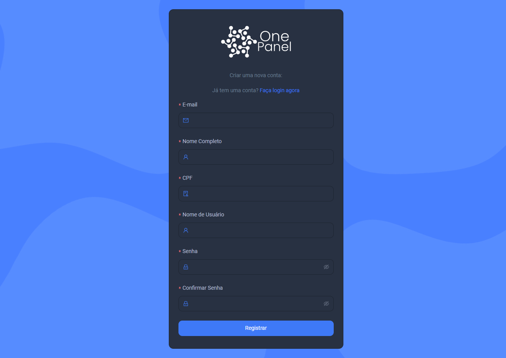
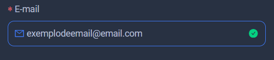
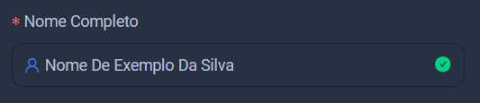
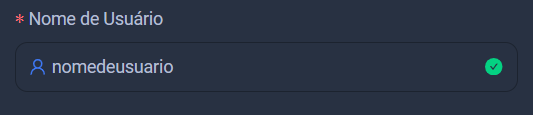
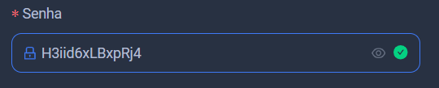

import Tabs from '@theme/Tabs';
import TabItem from '@theme/TabItem';

## Registro
 
A tela de registro será seu primeiro contato com a plataforma, é necessário ter um registro para conseguir prosseguir dentro da platafoma.

Agora vamos explicar todos os campos.

<Tabs>
  <TabItem value="email" label="E-mail" default>
    Nesse campo você precisa colocar seu e-mail válido.

  </TabItem>
  <TabItem value="nome completo" label="Nome Completo">

Nesse campo você irá colocar o seu nome completo.

  </TabItem>
  <TabItem value="nome de usuário" label="Nome de Usuário">
Um nome de usuário é uma identificação única que você usa em uma plataforma, funcionando como um apelido. Ele é utilizado para distinguir sua conta de outras, mas não é necessariamente o nome pelo qual você é chamado na interação.

  </TabItem>
  <TabItem value="Senha" label="Senha">
  A senha é uma combinação de caracteres utilizada para proteger sua conta e garantir a segurança das suas informações. Uma senha forte é essencial para proteger seus dados pessoais e assegurar a integridade da sua conta.

:::tip

Este é um exemplo de senha forte.

    

:::

    
  </TabItem>
</Tabs>

Após isso você pode clicar em *Registrar* e criar sua conta!.

## Completar cadastro

Para aproveitar ao máximo a One Panel, complete seu cadastro com seus dados pessoais. Vamos seguir para a próxima etapa.
