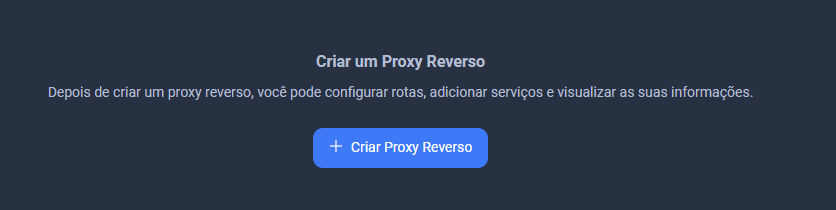
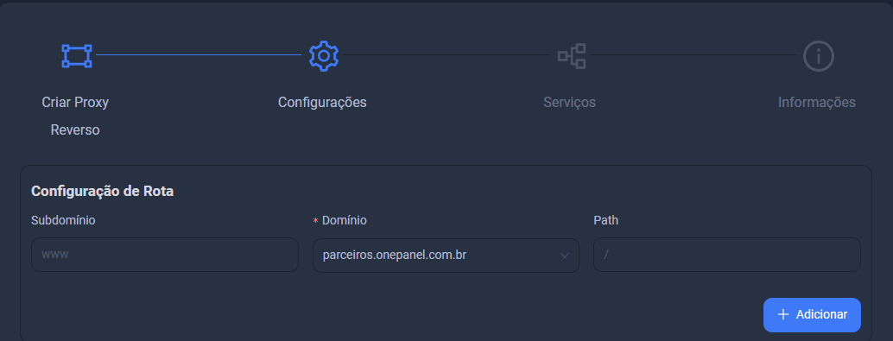
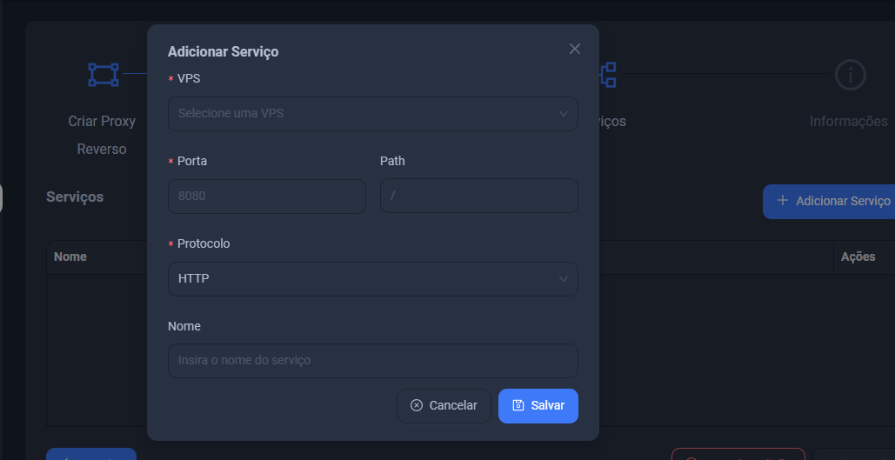

# Criação de um reverse proxy

Para criar um reverse proxy é muito simples em nosso painel.

Primeiro, vá até a aba `Proxy Reverso` ou clique [aqui](https://console.onepanel.com.br/app/reverse-proxy/new)

Preencha os campos como se pedem:

Após preencher os campos, clique em `Adicionar`

Prontinho, seu proxy reverso foi criado com sucesso.
