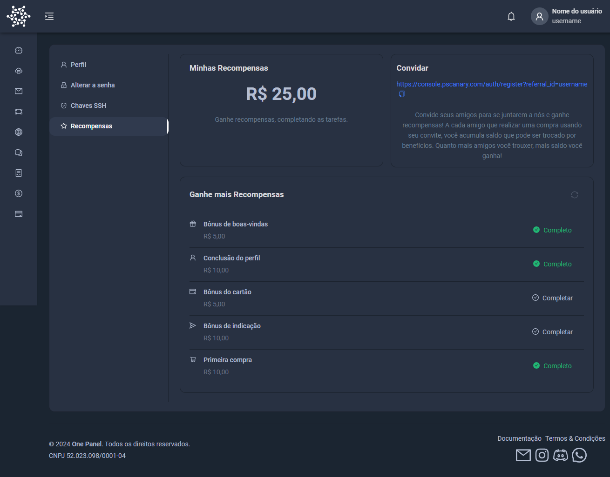

# Recompensas da Plataforma
A nossa plataforma oferece uma variedade de recompensas para incentivar e premiar nossos usuários. Confira abaixo os detalhes de cada tipo de recompensa disponível:

## Bônus de Boas-Vindas
   Ao se registrar na plataforma, novos usuários recebem um bônus de boas-vindas. Este bônus é uma ótima maneira de começar a explorar nossos serviços e benefícios. Basta criar uma conta e o bônus será automaticamente creditado em sua conta.

## Conclusão do Perfil
   Para garantir uma experiência personalizada, incentivamos os usuários a completar seu perfil. Ao fornecer informações adicionais, você poderá receber um bônus especial. Esta recompensa é nossa forma de agradecer por ajudar a criar uma comunidade mais engajada e relevante.

## Bônus do Cartão
   Usuários que vinculam seu cartão de crédito ou débito à plataforma são elegíveis para um bônus adicional. Este incentivo visa facilitar suas transações e oferecer um retorno extra em cada compra realizada. O bônus será creditado assim que o cartão for vinculado com sucesso.

## Bônus de Indicação
   Compartilhe sua experiência com amigos e familiares! Ao indicar novos usuários para a plataforma, você poderá receber um bônus de indicação sempre que a pessoa indicada concluir seu registro e realizar a primeira compra. Essa é uma excelente oportunidade de ganhar recompensas enquanto ajuda outros a descobrirem nossos serviços.

## Primeira Compra
   Ao realizar sua primeira compra na plataforma, você receberá um bônus exclusivo. Esta recompensa é uma forma de comemorar o início da sua jornada conosco e garantir que você tenha uma experiência positiva desde o primeiro momento.