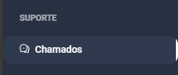
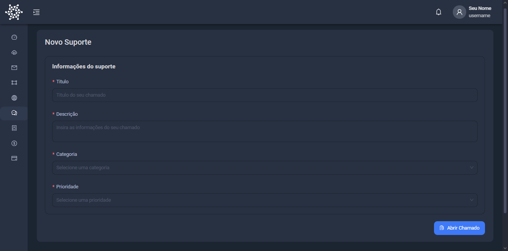

# Abrir tickets

Você pode abrir um ticket de suporte no [One Panel Support](https://console.onepanel.com.br/app/ticket)

1. Logue-se no [console](https://console.onepanel.com.br)

2. Clique em `Tickets` no menu lateral

3. Clique em `Adicionar Ticket`

4. Preencha os formulários e clique em `Adicionar`

5. O ticket foi criado com sucesso!

