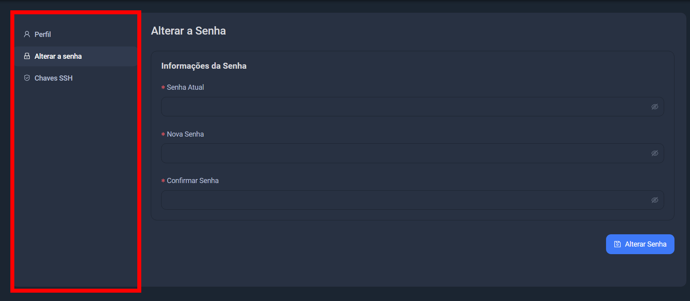

## VPS Pós pago

Pós pago, você pode usar o seu cartão de crédito para pagar o seu serviço.

## Opção Pré pago

Você pode adicionar crédito para pagar o seu serviço.

## Opção de pagamento

Você pode escolher entre o pagamento por cartão de crédito ou boleto bancário.

## Escolher o seu serviço

### VPS

O que é um VPS e como criar um VPS no Linux.

- [Criação de um VPS](/vps/criacao)
- [Como acessar um VPS](/vps/acesso)

### Email

O que é um **email** e como criar um email no Linux.

- [O que é um Email](/email)

### Reverse Proxy

O que é um **reverse proxy** e como criar um reverse proxy no Linux.

- [Criação de um reverse proxy](/reverse-proxy/criacao)

### Domínio

O que é um **domínio** e como criar um domínio no Linux.

- [O que é um Domínio](/domain)

### Ajuda

## Redefinir senha

Para mudar sua senha, acesse as configurações da conta, escolha a opção de alterar a senha, insira sua senha atual, crie uma nova senha e salve as alterações.

