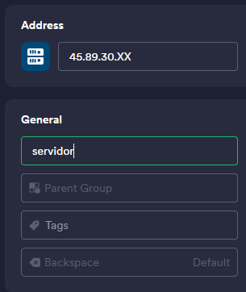
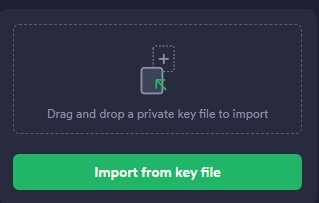

import Tabs from '@theme/Tabs';
import TabItem from '@theme/TabItem';

<Tabs>
  <TabItem value="root" label="Acessar com ROOT" default>
# Como acessar sua VPS por ROOT

Para acessar a sua VM é bem simples, como exemplo, usaremos o software [Termius](https://termius.com/).

Após acessar instalar o [Termius](https://termius.com/) você deve adicinar um novo host

Configurar o HOST da VM

Usuario e senha

Pronto, agora basta clicar em conectar.
  </TabItem>

  
  <TabItem value="acesso-ssh" label="Acessar com SSH">

# Como acessar sua VPS por ROOT

Para acessar a sua VM é bem simples, como exemplo, usaremos o software [Termius](https://termius.com/).

Após acessar instalar o [Termius](https://termius.com/) você deve ir até `Keychain`

Clique em `Key`

Depois em `Import Key`

Então volte em `Hosts` a cima de `Keychain`.

# Adicionado VM

Configurar o HOST da VM

Selecione sua Key

Agora é so conectar.

  </TabItem>
</Tabs>