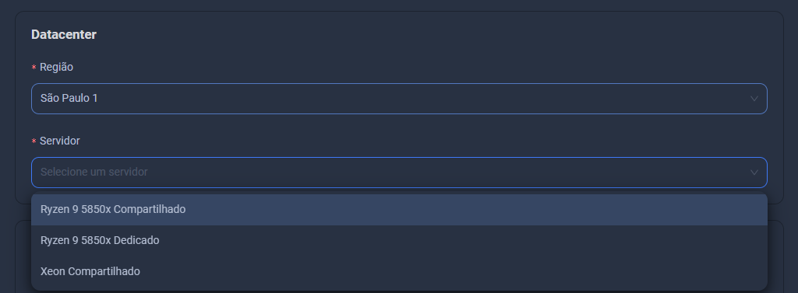
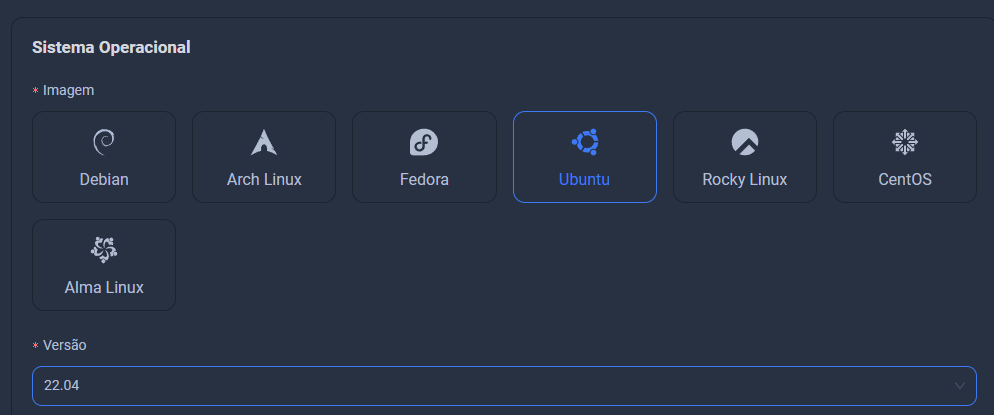
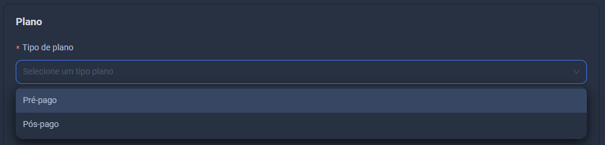
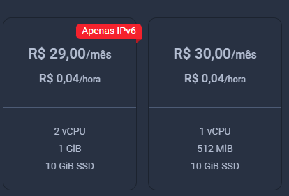

# Tipo de configuração da maquina

Aqui você seleciona como quer sua máquina, Xeon, compartilhado ou Dedicado.

Após selecionar a sua máquina, devemos escolher um SO para ela.

Aqui estarei selecionado o `Ubuntu` na sua versão `22.04`.

Agora, devemos selecionar o tipo de pagamento.

Caso queira um `IPv4` em sua VM tem um custo adicional adicional e só é permitido em VMs de tamanho que aceitam `IPv4`

Exemplo:

Porfim, pode clicar em `CRIAR`

