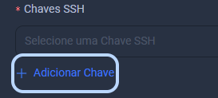

# Criação de um VPS

Aqui vocês irá aprender a criar sua primeira VPS.

Após ter criado sua conta e adicionado SALDO a ela você poderá seguir os seguintes
passos para criar sua primeira VM.

# Primeiros Passos

Em seu painel, navegue até a aba `VPS` e clique lá.

Clique em `ADICIONAR`.

Dê um nome a sua VM como por exemplo `servidor`.

- Essa parte é importante, aqui vocês deverá excolher a forma de acesso a sua VM
sendo ela `usuário ROOT` ou `Chave SSH`.

<Tabs>
  <TabItem value="ssh" label="Acesso SSH" default>
    Para configurar o acesso SSH você deve clicar em `Adicionar Chave`
    
  </TabItem>

  <TabItem value="nome completo" label="Nome Completo">
Nesse campo você irá colocar o seu nome completo.
</TabItem>
</Tabs>
