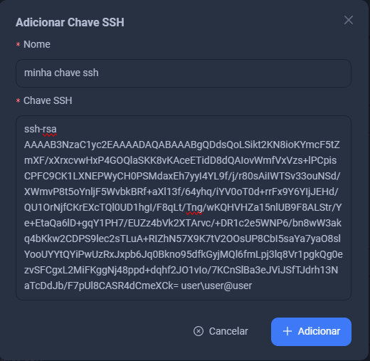

# Usando Chave SSH

Caso opte por usar uma `Chave SSH`, você deve seguir estes passos:

Clique em `Adicionar` 

Coloque sua chave da seguinte maneira: 

:::tip

Você deve usar chave publica aqui

::: 

Após isso clique em `Adicionar`