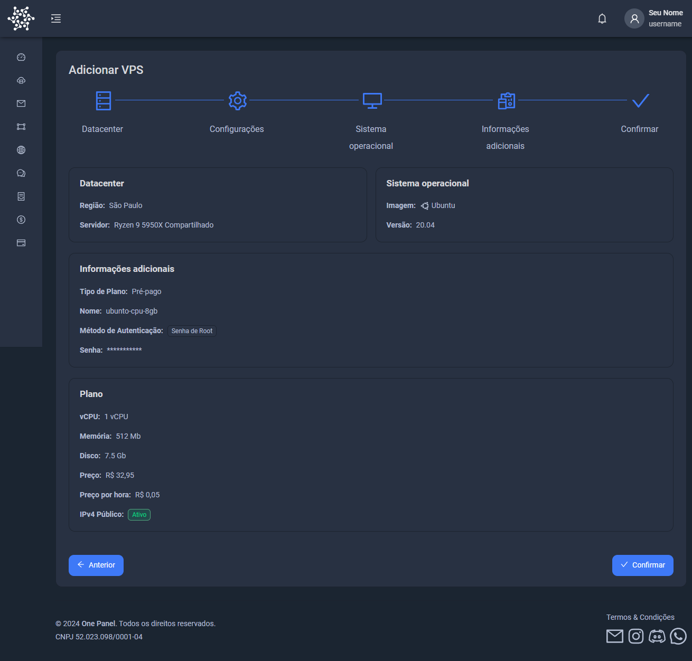

# O que é um VPS

Um VPS (Virtual Private Server) é um servidor virtual que permite a execução de vários servidores em um único servidor físico. Isso significa que é possível hospedar múltiplos sites em um único servidor, cada um com seu próprio IP e espaço de armazenamento. Um VPS é uma solução prática para empresas ou pessoas que necessitam de múltiplos servidores para hospedar seus sites ou aplicações, oferecendo uma alternativa flexível às máquinas virtuais tradicionais e aos serviços de hospedagem de sites.

## Vantagens de um VPS:

- Não é necessário utilizar seu próprio computador para hospedar sites ou aplicativos.
- Oferece um desempenho significativamente superior para suas aplicações.
- Elimina custos adicionais com rede ou energia.

## O que você vai aprender:

- Criar um servidor VPS.
- Configurar o acesso ao VPS.
- Acessar o servidor VPS de forma segura.

---

## Criação de um VPS

Após criar sua conta e adicionar saldo à sua carteira, siga os passos abaixo para configurar sua primeira VPS.

### Passo 1: Navegando para a aba VPS

No painel principal da plataforma, navegue até a aba `VPS` e clique nela.

### Passo 2: Adicionando uma VPS

Clique em `Adicionar`.

---

## Seleção de Node e Sistema Operacional

### Tipo de configuração da máquina

Neste passo, você deverá selecionar o tipo de configuração desejada para a sua VPS. As opções incluem o tipo do processador, máquinas compartilhadas ou dedicadas.

Após escolher o datacenter, configure a quantidade de vcpu, memória e espaço de disco para sua VPS. Neste exemplo, foi definido com a configuração basica.

Após configurar sua VPS, selecione o sistema operacional (SO) para sua VPS. Neste exemplo, escolhemos `Ubuntu 22.04`.

## Métodos de Acesso ao VPS

Você pode acessar sua VPS de duas formas principais: utilizando o `usuário ROOT` ou através de uma `Chave SSH`. Abaixo, explicamos como configurar ambos os métodos.

### Usando usuário ROOT

Para configurar o acesso via `usuário ROOT`, selecione a opção `Senha ROOT` e defina sua senha.

Após isso, sua VPS estará pronta para ser acessada com a senha ROOT que você definiu.

### Usando Chave SSH

Se preferir configurar o acesso por `Chave SSH`, siga os passos abaixo:

1. Clique em `Adicionar`.

2. Insira a chave SSH pública conforme mostrado na imagem abaixo:

:::tip
Lembre-se de utilizar uma **chave pública** aqui.
:::

3. Clique em `Próximo` para ir para a etapa de confirmação da configuração da VPS.

---

## Como Acessar sua VPS

Agora que a VPS está criada, você pode acessá-la de duas formas: por ROOT ou por SSH. Vamos detalhar os procedimentos para ambas as opções.

### Acesso com ROOT

Para acessar sua VPS via ROOT, recomendamos o uso do software [Termius](https://termius.com/). Siga os passos abaixo:

1. Instale o Termius e adicione um novo host.

   

2. Configure o HOST da sua VPS.

   

3. Insira seu usuário (ROOT) e a senha definida.

   

4. Clique em conectar para acessar sua VPS.

### Acesso com SSH

Se você configurou o acesso via `Chave SSH`, o procedimento é similar, mas com algumas diferenças:

1. Após instalar o Termius, vá até `Keychain`.

   

2. Clique em `Key`.

   

3. Em seguida, clique em `Import Key`.

   

4. Após importar a chave, volte para `Hosts` no menu principal.

5. Configure o HOST da VPS e selecione a chave SSH que você importou.

   

Agora basta conectar.

---

## Conclusão

Você agora aprendeu a criar, configurar e acessar sua primeira VPS na plataforma. Aproveite as vantagens do VPS e tenha controle total sobre seus servidores!
