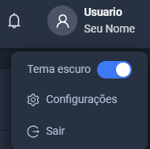
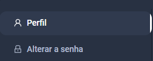
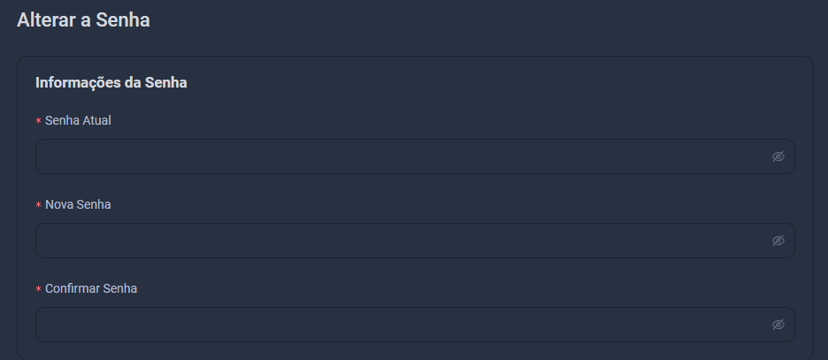

# Carteira

O que é a carteira?

A carteira é a aba onde você pode adicionar fundos para realizar compras na plataforma.

## Adicionando fundos

Para adicionar fundos à sua carteira, você pode utilizar métodos como cartão de crédito, boleto ou pix.

## Adicionando cartão

Para adicionar um cartão à sua carteira, siga as seguintes etapas:

1. Acesse a aba de cartões.
2. Clique em "Adicionar Agora".
3. Preencha os campos do formulário com as informações do seu cartão de crédito.
4. Clique em "Adicionar cartão".

Após adicionar o cartão, você poderá utilizá-lo para adicionar fundos a sua conta.

## Adicionando pix

Para adicionar um pix à sua carteira, siga as seguintes etapas:

1. Acesse a tela de configurações da sua carteira.
2. Clique em "Pix".
3. Coloque o valor do Pix (Minímo R$ 5,00).
4. Clique em "Adicionar Fundos".
5. Clique em "Confirmar pagamento".

Após adicionar o pix, você poderá utilizá-lo para adicionar fundos a sua conta.

## Adicionando boleto

Para adicionar um boleto à sua carteira, siga as seguintes etapas:

1. Acesse a tela de configurações da sua carteira.
2. Clique em "Boleto".
3. Coloque o valor do Boleto (Minímo R$ 10,00).
4. Clique em "Adicionar Fundos".
5. Clique em "Confirmar pagamento".

Após gerar o boleto, você poderá utilizá-lo para adicionar fundos a sua conta.

## Consultando saldo

Para consultar o saldo disponível em sua carteira, acesse a tela de configurações e clique em "Saldo". Lá você poderá visualizar o saldo atual em sua carteira ou na área principal.

## Histórico de transações

Para consultar o histórico de transações em sua carteira, acesse a tela de configurações e clique em "Carteira". Lá você poderá visualizar todas as transações realizadas em sua carteira.

## Alterando senha

Para alterar a senha de sua carteira, clique em configurações:

Vá Para `Alterar Senha`

Lá você poderá inserir a sua senha atual e a nova senha desejada.

## Excluindo cartão ou pix

Para excluir um cartão ou pix da sua carteira, acesse a tela de configurações e clique em "Excluir". Lá você poderá selecionar o cartão ou pix que deseja excluir e confirmar a exclusão.

## Precisa de ajuda?

Caso tenha alguma dúvida ou precise de ajuda com a sua carteira, entre em contato conosco pelo email [suporte@onepanel.com.br](mailto:suporte@onepanel.com.br).

